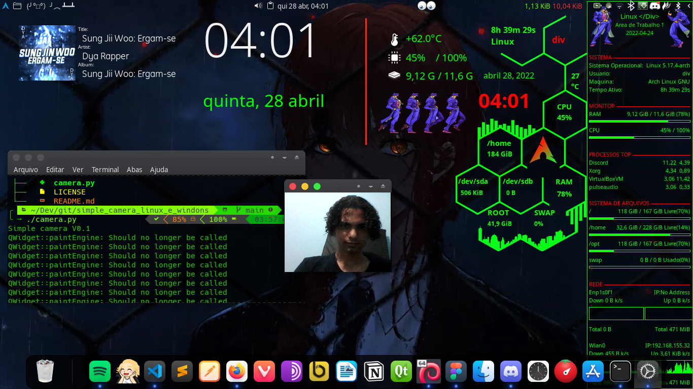

# Floating camera
Uma simples camera para todos os sistemas operacionais

<pre>
  git clone https://github.com/DIEGOHORVATTI/simple_camera_linux_e_windons.git
</pre>

<pre>
  cd ./simple_camera_linux_e_windons
</pre>

<pre>
  python ./camera
</pre>
